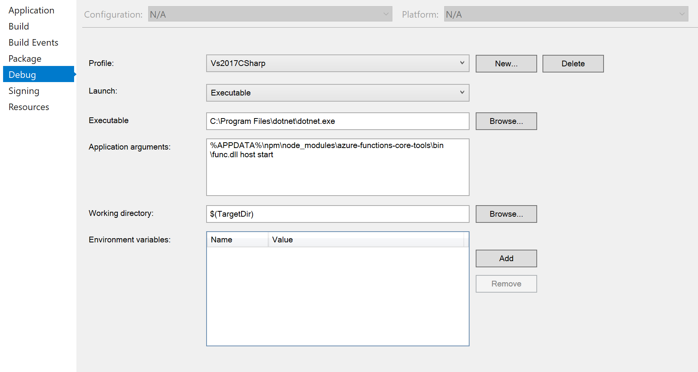

# Workshop - Azure Functions and CosmosDB

## Getting set up with Visual Studio 2017 (Windows / C#)

### Azure Functions

1. Download Visual Studio 2017 from <https://www.visualstudio.com/downloads/> if you don't have it already (though for speed you're probably better off skipping to the VS Code section).

2. Run the Visual Studio Installer (if VS2017's already installed, this'll be in your start menu), and make sure you have the **Azure development** workload selected. Amongst other things, this will install the Azure Storage emulator and the Azure Functions extension.

    

3. Launch Visual Studio and check in **Tools** -> **Extensions and Updates** if **Azure Functions and Web Jobs Tools** requires an update.

    

4. Create a new "Azure Functions" project. In the project creation options, select **Azure Functions v2 Preview (.NET Core)** as the project type, **HTTP trigger** as the initial function template and **Anonymous** access rights. You can either leave **Storage emulator** selected, or choose an actual Azure Storage account, but if you do select the emulator then don't forget two things:
    * Start the emulator :) It's **Microsoft Azure Storage Emulator** in the start menu.
    * If you deploy to Azure, you'll need to update the environment variables of the Function App to point to an Azure storage account.

5. You should now be able to debug the project and access your function via the URL shown in the terminal.

That's all you have to do in theory, but because we're using a preview I also recommend installing the latest version of the **Azure Functions Core Tools** for the best experience:

1. Install NodeJS from <https://nodejs.org/en/download/>.

2. Install the Core Tools package (note the `@core` at the end to specify that we want the 2.x pre-release rather than 1.x):

        npm install -g azure-functions-core-tools@core

3. Update your project debug settings (**Project properties** -> **Debug** tab) to use the following:
    * Launch: **Executable**
    * Executable: **C:\Program Files\dotnet\dotnet.exe**
    * Application Arguments: **%APPDATA%\npm\node_modules\azure-functions-core-tools\bin\func.dll host start**
    * Working Directory: **$(TargetDir)**

    

### CosmosDB

1. If you want to run locally, install the CosmosDB emulator from <https://aka.ms/cosmosdb-emulator>. Otherwise, set up a CosmosDB account in Azure.

2. (Optionally) install Azure Storage Explorer from <https://azure.microsoft.com/en-us/features/storage-explorer/>. This allows you to work with Azure CosmosDB and other storage accounts in a local app. Alternatively you can explore using the Azure Portal.

---

## Getting set up with Visual Studio Code (Windows/MacOS/Linux, C# / JS)

### Azure Functions

1. Install the **Azure Functions Core Tools**:

    * Windows:
        * Install **.NET Core 2.0** from <https://www.microsoft.com/net/download/windows>.
        * Install **NodeJS** from <https://nodejs.org/en/download/> (we need npm).
        * Install the **Core Tools** package:

                npm install -g azure-functions-core-tools@core

    * MacOS:
        * If you don't have it already, install **Homebrew** using the instructions at <https://brew.sh/>.
        * Install **.NET Core 2.0** from <https://www.microsoft.com/net/download/macos>.
        * Install the **Core Tools** package:

                brew tap azure/functions
                brew install azure-functions-core-tools

    * Linux:
        * Install **.NET Core 2.0** from <https://www.microsoft.com/net/download/linux>
        * Install **Core Tools** using the instructions for your distro at <https://github.com/Azure/azure-functions-core-tools#linux>

2. Download and install Visual Studio Code from <https://code.visualstudio.com/Download> if you don't have it already.

3. Install the VS Code **Azure Functions** extension from Microsoft.

4. Create a new "Azure Functions" project: Expand Azure Functions in the explorer and click the **Create Project** icon:

    

    Choose a folder and language for your project. Download the latest templates if prompted.

5. Click the **Create Function** icon and add an HTTP triggered function.

6. You should now be able to debug the project and access your function via the URL shown in the terminal.

### CosmosDB

1. In VS Code, install the **Azure Cosmos DB** extension from Microsoft.

2. If you're on Windows and want to run locally, install the CosmosDB emulator from <https://aka.ms/cosmosdb-emulator>. Otherwise, set up a CosmosDB account for DocumentDB/SQL access in Azure. You can do this either through the portal or through **Azure Cosmos DB** in the VS Code explorer.

3. (Optionally) install Azure Storage Explorer from <https://azure.microsoft.com/en-us/features/storage-explorer/>. This allows you to work with Azure CosmosDB and other storage accounts in a local app. Alternatively you can explore using the Azure Portal.

---

## Things to try

Once you've got an HTTP triggered function up and running, try building a Functions app that "translates" text by having a go at some of these:

* Create a CosmosDB collection.

* Create a `Translate` CosmosDB triggered function that processes new documents in the collection containing a `text` field and adds a `translated` field containing the translated text (you can try using Cognitive Services if you really want, but any transformation you want will do!).

* Create an `AddText?text={whatever}` function that creates a new document. This should then trigger the `Translate` function.

* Create a `GetText/{id}` function that returns the `text` field of the document with the provided ID.

* Create a `GetTranslation?text={whatever}` that returns the translation of the provided text.

* Deploy your function app to Azure using the Visual Studio tools, Git deployment or ZIP deployment.

* Set up a new function app (v1) and use Proxies to merge that app and your translation app respond into a single URL.

* Create a v1 app, add the Durable Functions Nuget package and create an HTTP triggered function that uses fan-in/fan-out to perform parallel text translation into multiple languages.

## Hints

* You'll want these NuGet package references in your .csproj file:

        <PackageReference Include="Microsoft.Azure.DocumentDB" Version="1.22.0" />
        <PackageReference Include="Microsoft.Azure.WebJobs.Extensions.CosmosDB" Version="3.0.0-beta7" />
        <PackageReference Include="Microsoft.NET.Sdk.Functions" Version="1.0.13" />

* Create an setting in local.settings.json with your CosmosDB connection string (get it from the portal, or use `AccountEndpoint=https://localhost:8081;AccountKey=C2y6yDjf5/R+ob0N8A7Cgv30VRDJIWEHLM+4QDU5DE2nQ9nDuVTqobD4b8mGGyPMbIZnqyMsEcaGQy67XIw/Jw==` for the emulator). Use the setting name in the bindings.

* The CosmosDB trigger needs a "lease" collection. The simplest way to enable this is to specify `CreateLeaseCollectionIfNotExists = true` in the binding.

* If you deploy to Azure, don't forget to set any environment variables that refer to local emulators to point to Azure resources instead.

* All the functions apart from GetTranslation can be accomplished purely with CosmosDB bindings without having to use the API.

## Useful links

* HTTP binding for Azure Functions: <https://docs.microsoft.com/en-us/azure/azure-functions/functions-bindings-http-webhook>

* CosmosDB binding for Azure Functions: <https://docs.microsoft.com/en-us/azure/azure-functions/functions-bindings-cosmosdb>

* ZIP deployment for Azure Functions: <https://docs.microsoft.com/en-us/azure/azure-functions/deployment-zip-push>

* Durable Functions: <https://github.com/Azure/azure-functions-durable-extension>

* Setting up for local development: <https://docs.microsoft.com/en-us/azure/azure-functions/functions-run-local>

* Visual Studio 2017 tools: <https://docs.microsoft.com/en-us/azure/azure-functions/functions-develop-vs>
